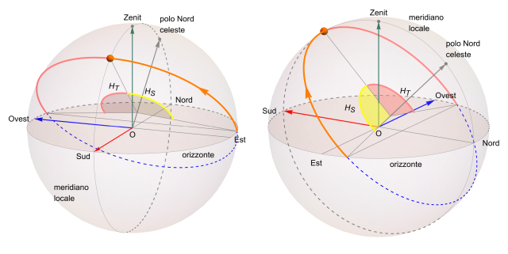

# Coordinate solari e posizione apparente del Sole

## Un percorso di Astronomia posizionale

 

Riportiamo in questo repo alcuni materiali didattici che si affiancano alle pagine di [Astronomia posizionale](https://www.lorenzoroi.net/astronomia) pubblicate nel sito personale [https://www.lorenzoroi.net](https://www.lorenzoroi.net). 

Questi materiali sono rappresentati da uno script Python e da un notebook Jupyter. Quest'ultimo contiene le medesime funzioni dello script ma vi sono compresi commenti più estesi. Entrambi permettono di calcolare le principali grandezze associate alle posizioni solari e alle coordinate solari, sia equatoriali che altazimutali. Vengono inoltre calcolati i tempi dell'alba, del mezzogiorno vero e del tramonto..

## Files

I nomi dei file distribuiti sono:

* lo script Python  [coordinateSolari.py](coordinateSolari.py),
* il notebook nel formato [Jupyter](https://jupyter.org/), [coordinateSolari.ipynb](./coordinateSolari.ipynb).

## Consultazione

Per una lettura *non interattiva* del notebook selezionare l'icona di *nbviewer* per avviarne la visualizzazione.

 

Nel caso invece si intenda eseguire il calcolo online sia con lo script che con il notebook Jupyter lanciare *Binder* con i tasti sottostanti.

Nel caso dello script

 

selezionare una console con *New Launcher* e quindi *Other* e avviarlo con il kernel *python coordinateSolari.py*.

Per il notebook, avviare ciascuna cella oppure selezionare da menu *Run/Run All Cells*.

 

*[Lorenzo Roi](mailto:LRoi@mclink.it)*
